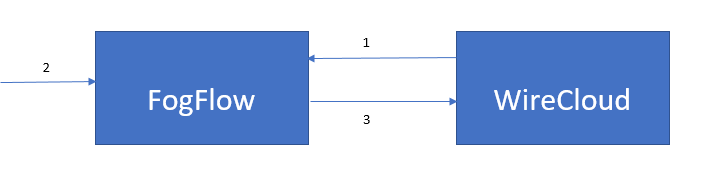
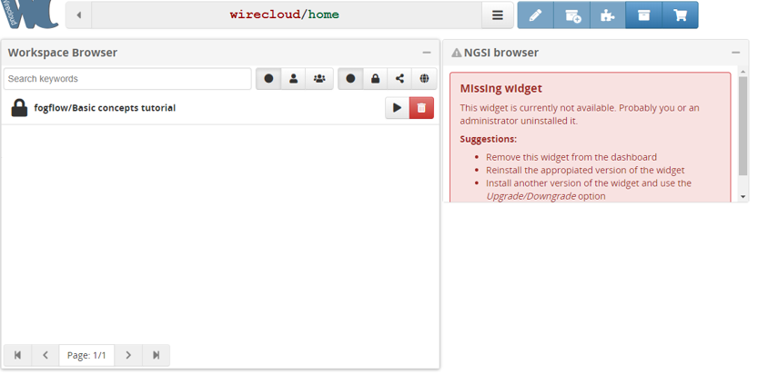
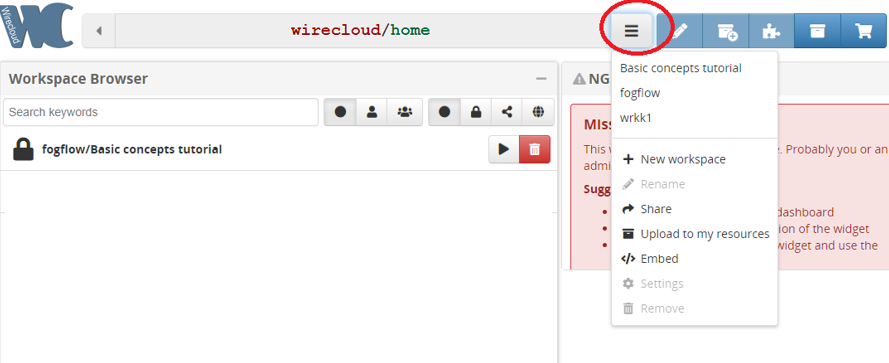
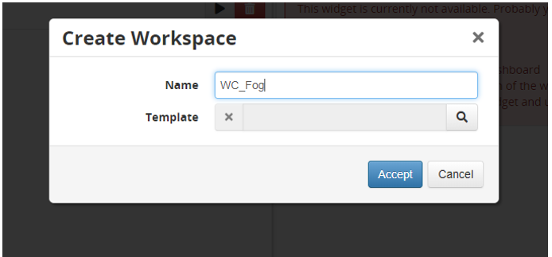
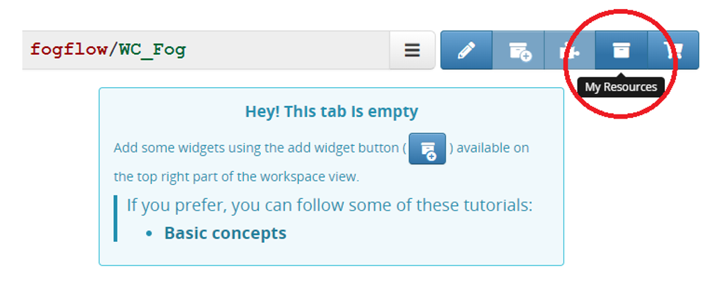
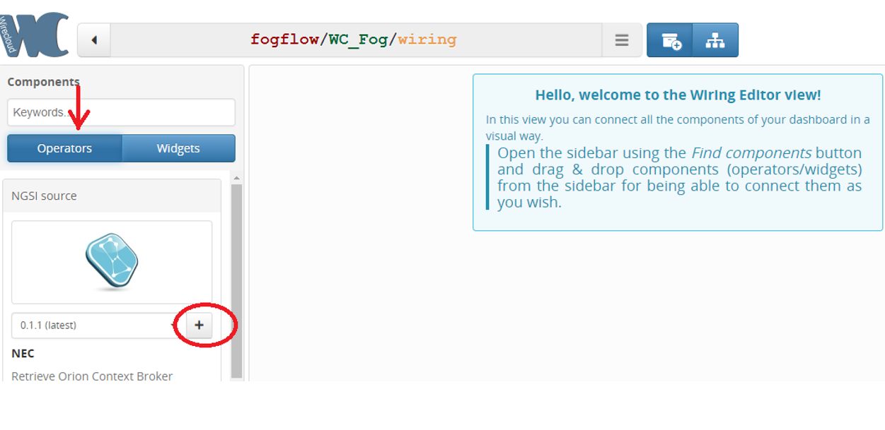
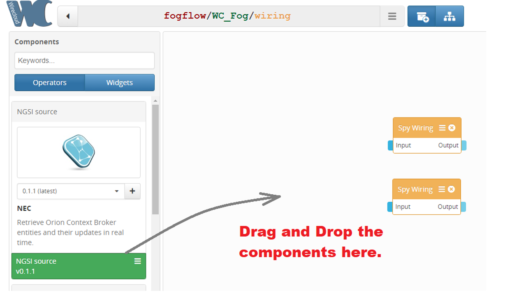
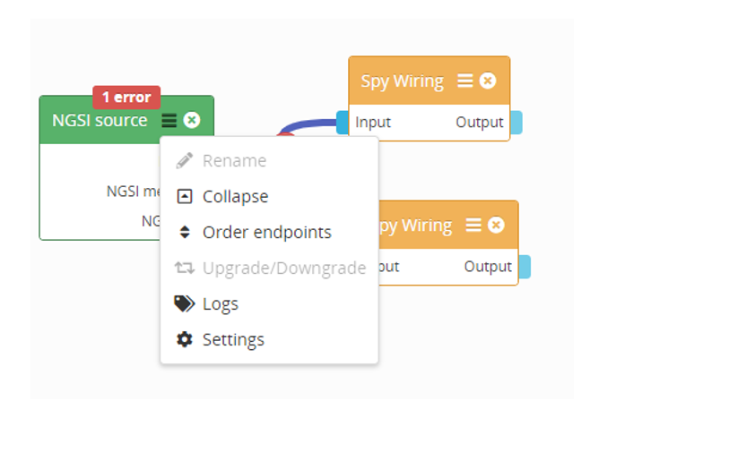

*****************************************
FogFlow を WireCloud と統合
*****************************************

`WireCloud`_ 、最先端のエンドユーザー開発、RIA、およびセマンティック テクノロジーに基づいて構築されており、サービスのインターネットのロングテールを活用することを目的とした次世代のエンドユーザー中心の Web アプリケーション マッシュアップ プラットフォームを提供します。

.. _`WireCloud`: https://wirecloud.readthedocs.io/en/stable/

次の図は、FogFlow と WireCloud の統合を示しています。

1. WireCloud は、NGSIv2 のFogFlow Broker にサブスクリプション リクエストを送信します。
2. ユーザーは、アップデート要求を NGSIv1 のFogFlow Broker に送信します。
3. FogFlow Broker はNGSIv2 で WireCloud に通知します。

統合手順
===============================================

**前提条件:**

* FogFlow は、少なくとも1つのノードで稼働している必要があります。
* WireCloud は、WireCloudのインストール手順 (`WireCloud installation steps`_) を実行している必要があります。

.. _`WireCloud installation steps`: https://wirecloud.readthedocs.io/en/stable/installation_guide/

* FIWARE NGSI-Proxy は、NGSI-Proxy のインストール手順 (`NGSI-Proxy installation steps`_) を実行している 必要があります。

.. _`NGSI-Proxy installation steps`: https://github.com/conwetlab/ngsi-proxy 

**WireCloud を使用してFogFlow をサブスクライブする手順:**

**ステップ1:** Wirecloud ダッシュボード ホームを開きます。

**ステップ2:** 新しいワークスペースを追加します。

**ステップ3:** 新しいワークスペースに名前を付けます。

**ステップ4:** 新しいワークスペース WC_fog を作成しました。

.. figure:: ../../en/source/figures/wc-workspace-created.png

**ステップ5:** ユーザーが作成したすべてのリソースといくつかのデフォルトのリソースを表示します。

**ステップ6:** WireCloud ライブラリで利用可能なリソースと Wiget。

.. figure:: ../../en/source/figures/wc-myresources.png

**ステップ7:** 独自のワークスペースのワイヤーリングを作成します。

.. figure:: ../../en/source/figures/wc-wiring-button.png

**ステップ8:** セクションで Find components をクリックします。

.. figure:: ../../en/source/figures/wc-find-components-button.png

**ステップ9:** データを表示するための2つの Spy wiring Widget と、エンティティを表示するための2番目のウィジェットを追加します。ユーザーは独自のウィジェットを使用してデータを表示し、要件に応じてエンティティの詳細を確認できます。

.. figure:: ../../en/source/figures/wc-wiring_add-widget.png

**ステップ10:** 指定されたデータの Context Broker をサブスクライブするためにNGSI source Widget を追加します。

**ステップ11:** 追加したコンポーネントを作業スペースにドラッグ アンド ドロップします。

**ステップ12:** 下の図のようにドロップされたコンポーネントを追加します。NGSI source のエンティティに接続された Spy wiring はデータを表示し、NGSI type の他の1つのコンポーネントはエンティティの詳細を表示します。

.. figure:: ../../en/source/figures/wc-wire-components.png

**ステップ13:** NGSI ソースの設定に移動して、Context Broker へのサブスクリプション要求用に構成します。

**ステップ14:** FogFlow broker の URL (NGSI server URL)、NGSI proxy URL、NGSI エンティティ タイプ、ID pattern、属性を指定し、Accept をクリックしてサブスクリプション リクエストをヒットします。

.. figure:: ../../en/source/figures/wc-operator-settings-form.png

上記のサブスクリプションで定義されたタイプと属性のエンティティを使用して、FogFlow Broker に **アップデート リクエストを送信** します。リクエストの例を以下に示します:

.. code-block:: console

        curl -iX POST \
        'http://<Fogflow broker>:8070/ngsi10/updateContext' \
         -H 'Content-Type: application/json' \
        -d '
      {
        "contextElements": [{
                "entityId": {
                        "id": "Room1",
                        "type": "Room",
                        "isPattern": false
                },
                "attributes": [{
                        "name": "temperature",
                        "type": "Integer",
                        "value": 155
                }],
                "domainMetadata": [{
                        "name": "location",
                        "type": "point",
                        "value": {
                                "latitude": 49.406393,
                                "longitude": 8.684208
                        }
                }]
        }],
        "updateAction": "UPDATE"
     }'
	 
**結果:**

.. figure:: ../../en/source/figures/WCresult.png

